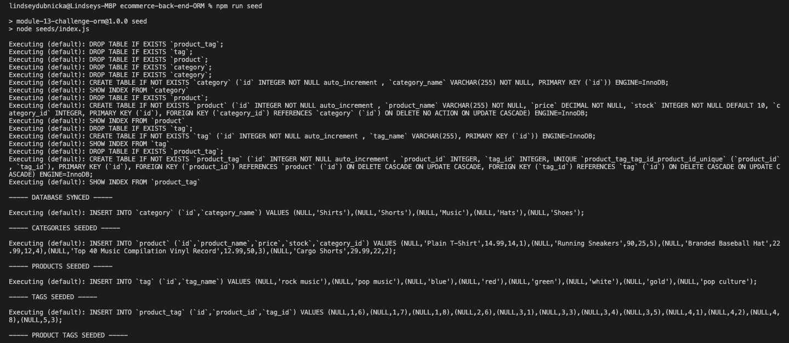
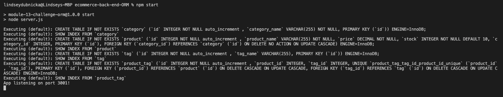

# E-commerce Back End

## Description
This repository contains the backend code for an e-commerce site. It uses a MySQL database with an Express server. It also uses Sequelize as the ORM in order to interact with the MySQL database. 
  
## Installation
This application uses Node.js, Express, MySQL12, Sequelize and dotenv. To install necessary dependencies, run the following command: 
```
npm install
```

## Usage
After installing the necessary dependencies, you can seed the database by using the command `npm run seed`. The application should then be invoked from the command line by entering: `npm start`. The screen shots below will give you an idea of how this application should work, or checkout the video link below to get a step-by-step demo. <br />
https://drive.google.com/file/d/1w3G4GggBKNrIxOy4Qz9RDdk_vGgXO_xU/view?usp=sharing 

Seed the database: <br />
 <br />
<br />
Start the application: <br />
 <br />

## Questions
Feel free to reach out to me for any questions or comments. <br/>
Link to my GitHub: github.com/lindseymiller2567